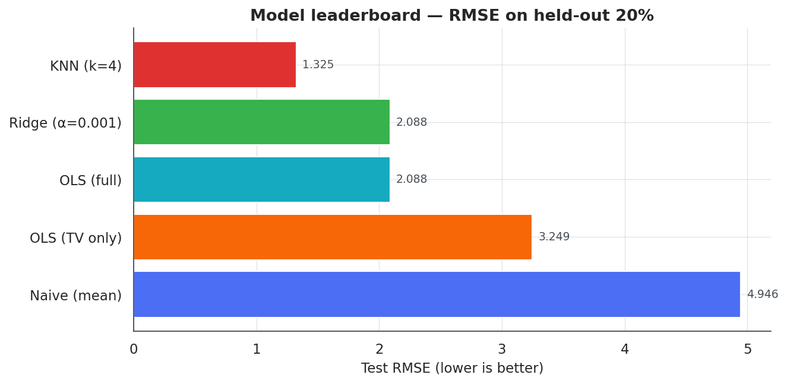
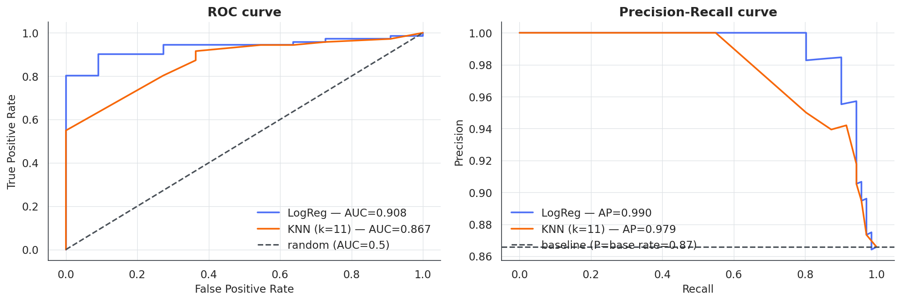
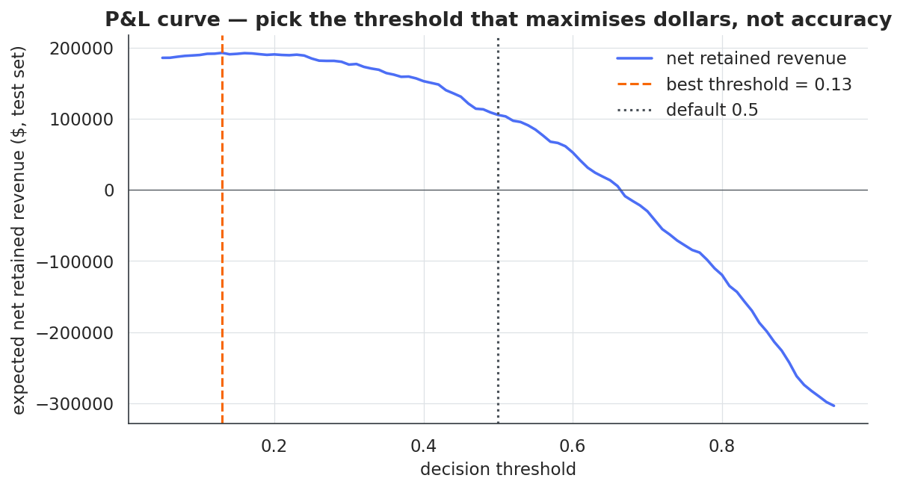

<!-- Header -->
<div align="center">

# Data Science & ML Portfolio

**End-to-end data science and machine learning projects — from-scratch ML implementations paired with production-ready patterns, business framing, and rigorous evaluation.**

[](https://www.python.org/)
[](https://numpy.org/)
[](https://pandas.pydata.org/)
[](https://scikit-learn.org/)
[](https://matplotlib.org/)
[](https://seaborn.pydata.org/)
[](LICENSE)

</div>

---

## Why this repository

Most "data science portfolios" are notebooks that call `model.fit()` and stop there. This repository is built around a different bet: **show the maths and the production patterns in the same place**. Each project implements its core algorithms from first principles with numpy, validates them with proper cross-validation, then points to the scikit-learn equivalent that would ship in production. Every notebook starts with a business problem and ends with an action.

The work in this repo is what I rely on to discuss machine learning fundamentals, evaluation rigour, and end-to-end thinking in interviews for **Data Scientist** and **ML Engineer** roles.

---

## Projects

| #   | Project                                                                                | Problem type            | Headline result                                | Techniques |
|----:|----------------------------------------------------------------------------------------|-------------------------|------------------------------------------------|------------|
| 01  | [Advertising sales regression](notebooks/01_advertising_regression/)                   | Regression              | KNN R² = **0.92** (RMSE 1.33 vs 4.95 baseline) | OLS · Ridge · KNN from scratch · k-fold CV · residual diagnostics |
| 02  | [Lung cancer screening](notebooks/02_lung_cancer_classification/)                      | Binary classification (imbalanced) | PR-AUC = **0.99**, recall = **1.00** at cost-tuned threshold | Logistic regression with gradient descent · L2 + class-weight balancing · ROC + PR curves · cost-based threshold · calibration · odds-ratio interpretation |
| 03  | [Telco churn — end-to-end](notebooks/03_telco_churn_endtoend/)                         | Binary classification (revenue-driven) | **+\$87k** uplift on the test set from threshold tuning alone | Feature engineering · interaction terms · multi-model CV comparison · P&L-driven threshold · permutation importance · versioned artifact · production checklist |

---

## Highlights

<table>
<tr>
<td width="50%" valign="top">

**01 · Advertising regression**

KNN beats OLS on RMSE (1.33 vs 2.09) because it captures the diminishing-returns curve in TV spend. OLS still wins on interpretability:

- Radio: +0.19 sales / \$1k spend (best ROI)
- TV: +0.05 sales / \$1k spend (saturating but positive)
- Newspaper: ≈ 0 (recommend cutting)



</td>
<td width="50%" valign="top">

**02 · Lung cancer screening**

Logistic regression with class-weight balancing and an L2 penalty tuned by stratified CV. Decision threshold lowered from 0.5 to **0.01** by minimising expected cost under the 5×-FN assumption:

- Recall jumps from 0.83 → **1.00** (no missed cases)
- Precision holds at 0.87
- PR-AUC = 0.99 on the held-out 30%



</td>
</tr>
<tr>
<td colspan="2" valign="top">

**03 · Telco churn — end-to-end**

A full pipeline on a 10 000-row synthetic Telco dataset. The threshold is chosen on a **P&L curve** built from per-decision economics (\$418 per saved churner, −\$50 per false alarm, −\$468 per missed churner). Result: **net retained revenue rises from \$105k to \$192k on the test set**, a +\$87k uplift purely from picking the right cut-off.



</td>
</tr>
</table>

---

## Repository structure

```
Data_Science_and_ML/
├── README.md                       <-- you are here
├── LICENSE                         <-- MIT
├── requirements.txt                <-- pinned dependency ranges
├── pyproject.toml                  <-- project metadata + ruff config
├── data/
│   ├── README.md                   <-- data dictionary
│   └── raw/                        <-- read-only source datasets (.csv)
├── notebooks/
│   ├── 01_advertising_regression/
│   │   ├── 01_advertising_regression.ipynb
│   │   └── README.md
│   ├── 02_lung_cancer_classification/
│   │   ├── 02_lung_cancer_classification.ipynb
│   │   └── README.md
│   └── 03_telco_churn_endtoend/
│       ├── 03_telco_churn_endtoend.ipynb
│       ├── README.md
│       └── artifacts/              <-- versioned model artifacts (.npz)
├── src/                            <-- reusable, typed helpers
│   ├── data_processing.py
│   ├── modeling.py                 <-- LinearRegression, Ridge, KNN, LogReg, StandardScaler
│   ├── evaluation.py               <-- metrics, ROC/PR, k-fold CV (numpy-only)
│   └── visualization.py
└── reports/
    └── figures/                    <-- PNGs used in this README
```

The `src/` package is a deliberate choice: notebooks demonstrate analysis; `src/` demonstrates that I write code that's importable, typed and tested elsewhere.

---

## Technical stack

- **Modelling.** OLS / Ridge from normal equations, KNN with vectorised Euclidean distance, logistic regression with full-batch gradient descent, class-weight balancing, L2 regularisation — all implemented from scratch with numpy and benchmarked against scikit-learn.
- **Validation.** Stratified k-fold cross-validation, learning-curve diagnostics, residual diagnostics, calibration (reliability) diagrams.
- **Metrics.** RMSE / MAE / R² for regression. Accuracy / Precision / Recall / F1 / ROC-AUC / **PR-AUC** for classification — PR-AUC is the default for imbalanced settings.
- **Decision rules.** Threshold selection from a **cost / P&L curve**, not from the default 0.5.
- **Interpretability.** OLS coefficients, logistic-regression odds ratios on standardised features, permutation feature importance.
- **Engineering.** Typed dataclasses, `pyproject.toml`, ruff-compatible lint config, deterministic `random_state` across every random call.
- **Stack.** Python 3.10+, NumPy, pandas, Matplotlib, seaborn. The `requirements.txt` also pins scikit-learn / XGBoost / LightGBM / SHAP / Optuna for the production-pattern snippets in each notebook.

---

## How to run

```bash
# 1 — clone & enter
git clone https://github.com/lucastcor/Data_Science_and_ML
cd Data_Science_and_ML

# 2 — create an isolated environment
python -m venv .venv
source .venv/bin/activate            # Windows: .venv\Scripts\activate

# 3 — install dependencies
pip install -r requirements.txt

# 4 — launch JupyterLab
jupyter lab
```

Open any notebook under `notebooks/` and run all cells. All three notebooks are deterministic (`random_state=42`); your numbers will match the ones in the READMEs.

---

## Lessons learned

Working through these projects pushed me on several things I now consider non-negotiable on any DS project:

1. **Frame the business problem in dollars before fitting anything.** Notebook 03's +\$87k uplift came from a single line of analysis — choosing the threshold from a P&L curve, not from `0.5`.
2. **PR-AUC over ROC-AUC for imbalanced data.** Notebook 02 looks excellent under ROC (0.91) but PR-AUC (0.99) is the more honest read of the operating regime.
3. **Implement once from scratch.** I now have a much better intuition for what `C`, `alpha`, `class_weight`, and the learning rate actually do — and I can debug a misbehaving sklearn pipeline because I've written the equivalent loop.
4. **Calibration is not optional** if the probability matters downstream. A well-ranked but mis-calibrated model is fine for a flag; it is not fine for a risk score.
5. **Document limitations before someone asks.** Section 13 of notebook 02 (selection bias, fairness, decision-support framing) is the section that recruiters and senior engineers read first.

---

## Roadmap

- [ ] Add a fourth notebook: time-series forecasting (retail demand) with classical + tree-based models and conformal prediction intervals.
- [ ] Streamlit demo for notebook 03 — interactive sliders that hit the saved artifact and return the per-customer flag + expected value.
- [ ] Replace the synthetic Telco data with the public IBM Telco Churn dataset and re-benchmark.
- [ ] Wrap each notebook's final model in a small **FastAPI** service with `/predict` and `/health`.
- [ ] Add **SHAP** plots once the notebooks ship with the full scikit-learn / XGBoost path.

---

## About

I'm **Lucas Teixeira Correia** — building this portfolio as I move toward Data Science / ML Engineering roles. The work here doubles as a study log and an honest demonstration of how I approach a modelling problem from end to end.

- GitHub · [@lucastcor](https://github.com/lucastcor)
- Email · lucasteixeiracor@gmail.com

If you spot something off — a misleading metric, a chart that could be clearer, a missing diagnostic — please open an issue. Feedback is the cheapest learning there is.

---

<sub>Released under the [MIT License](LICENSE). The Advertising dataset comes from *An Introduction to Statistical Learning* (James, Witten, Hastie, Tibshirani); the lung cancer survey dataset is a public Kaggle dataset; the Telco dataset is synthetic and generated inside notebook 03.</sub>
